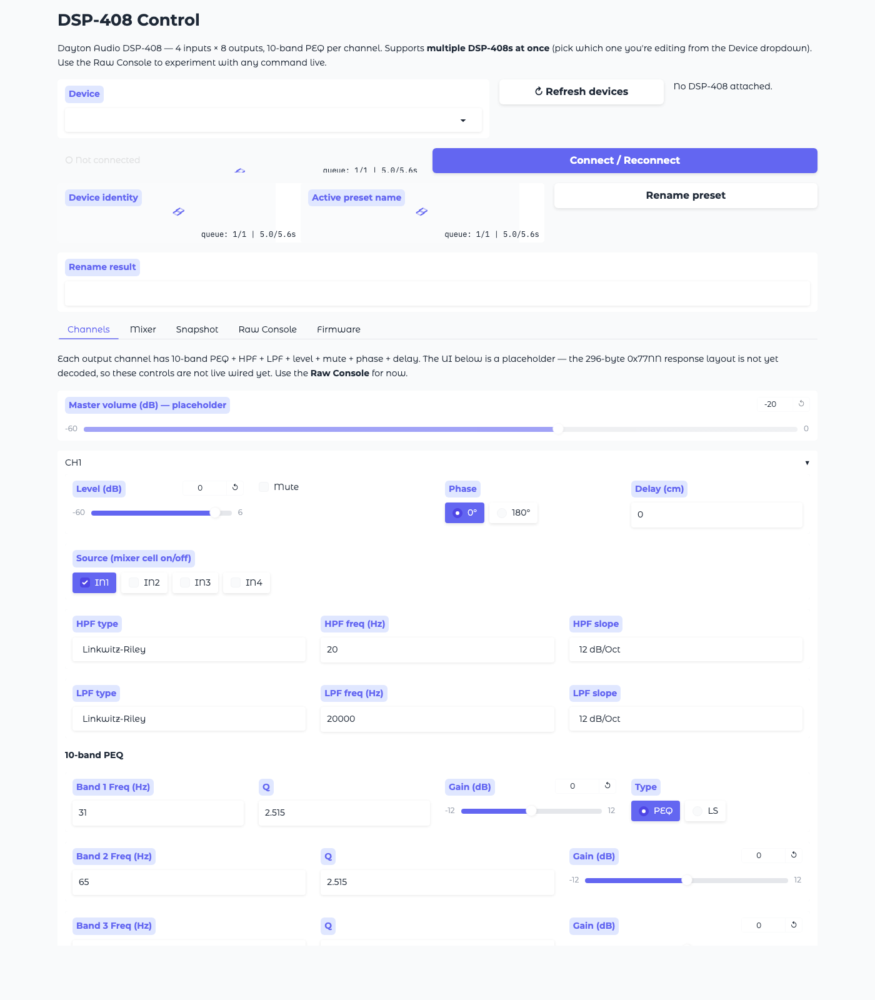

# dsp408-py — Dayton Audio DSP-408 USB control, reverse-engineered

[](https://github.com/malaiwah/dsp408-py/actions/workflows/ci.yml)

A from-scratch, cross-platform (Linux/macOS) implementation of the
Dayton Audio **DSP-408** USB control protocol, reverse-engineered from
Windows USBPcap captures of the official `DSP-408.exe` V1.24 GUI.

Two things this stack does that the Windows app does *not*:

* **Controls multiple DSP-408s at once** — the official app is single-device.
* **Exposes everything over MQTT with Home Assistant auto-discovery** —
  drop the bridge on a Pi and every DSP-408 plugged into it shows up as
  a device in HA automatically, with entities for identity, preset
  name, status, and a `raw` command channel.

| Subsystem          | Status                                              |
|--------------------|-----------------------------------------------------|
| Transport (HID)    | **Working** — `80 80 80 ee` envelope, single + multi-frame reads |
| Connect / identity | **Working** — `dsp408 info` returns `MYDW-AV1.06`   |
| Preset name read/write | **Working**                                     |
| Firmware flash     | **Working** — proven on Windows, incl. recovery path |
| Multi-device       | **Working** — select by index / serial / path       |
| MQTT + HA discovery| **Working** — one device-based config per DSP-408    |
| Channel state read (`0x77NN`) | **Raw bytes only** — layout still TBD    |
| Parameter write (`0x1fNN`) | **Framing correct** — sub-index → param mapping TBD |
| Mixer 4×8 routing  | Not implemented                                     |
| Gradio web UI      | Device picker + raw console + firmware flash; typed widgets are placeholders |

## Install

```bash
# from a clone of this repo, on Linux or macOS:
uv sync --extra ui --extra mqtt     # library + Gradio UI + MQTT bridge
# or picking and choosing:
uv sync --extra ui                  # just the web UI
uv sync --extra mqtt                # just the MQTT bridge
uv sync                             # library only
```

This installs `hidapi` (required) plus `gradio` and `paho-mqtt` as
optional extras. On Linux you also need the `libhidapi-libusb0` system
package and a udev rule to let your user open `/dev/hidraw*`:

```
# /etc/udev/rules.d/60-dsp408.rules
# Running firmware — cython-hidapi from PyPI uses libusb on Linux so we need
# the `usb` subsystem rule in addition to hidraw:
SUBSYSTEM=="hidraw", ATTRS{idVendor}=="0483", ATTRS{idProduct}=="5750", MODE="0660", GROUP="plugdev", TAG+="uaccess"
SUBSYSTEM=="usb",    ATTRS{idVendor}=="0483", ATTRS{idProduct}=="5750", MODE="0660", GROUP="plugdev", TAG+="uaccess"
# STM32 DFU bootloader (for `dsp408 flash` recovery path):
SUBSYSTEM=="usb",    ATTRS{idVendor}=="0483", ATTRS{idProduct}=="df11", MODE="0660", GROUP="plugdev", TAG+="uaccess"
```

Reload udev after editing:

```bash
sudo udevadm control --reload-rules && sudo udevadm trigger
```

## Device aliases

When you have more than one DSP-408 plugged into the same host, the
default `display_id` (serial if present, otherwise a `dsp408-<hash>`
derived from the USB path) is stable but unfriendly. Drop a small TOML
file to give each unit a human name:

```toml
# ~/.config/dsp408/aliases.toml
[aliases]
"4EAA4B964C00"    = "Living Room Subs"
"dsp408-cf594b63" = "Garage Amp"
```

Keys are matched against (in order) the device's `serial_number`,
`display_id`, or stringified hidapi path — so `dsp408 list` tells you
exactly what string to use. Friendly names then surface everywhere:

* `dsp408 list` shows them in a dedicated column.
* `dsp408 --device "Living Room Subs" info` — selectors match friendly
  names just like index / serial / path.
* The Gradio dropdown labels entries `[N] Living Room Subs · 4EAA4B964C00`.
* Home Assistant discovery uses the alias as the MQTT device name, so
  the card in HA says "Living Room Subs" instead of "DSP-408 (4EAA…)".

Search order (later wins, so user config overrides system-wide):

1. `/etc/dsp408/aliases.toml`
2. `$XDG_CONFIG_HOME/dsp408/aliases.toml` (default `~/.config/dsp408/aliases.toml`)
3. `./dsp408-aliases.toml` (working directory)

Or pass `--aliases PATH` to any `dsp408` subcommand to load a single
file explicitly and skip the search.

## CLI

```bash
uv run dsp408 list                      # enumerate every DSP-408
uv run dsp408 info                      # first device
uv run dsp408 --device 1 info           # second device (by index)
uv run dsp408 --device MYDW-AV1234 info # select by serial
uv run dsp408 --device "Garage Amp" info  # select by alias (see below)
uv run dsp408 --aliases ./my.toml list    # use an explicit aliases file
uv run dsp408 snapshot                  # full startup handshake dump
uv run dsp408 read 0x04                 # raw read by cmd code
uv run dsp408 read-channel 0            # 296-byte channel-state blob
uv run dsp408 write 1f07 "01 00 96 01 00 00 00 12" --cat 04
uv run dsp408 poll --interval 1
uv run dsp408 flash path/to/DSP-408-Firmware.bin
uv run dsp408 mqtt --broker mqtt.local --username ha --password secret
```

## Web UI



```bash
uv run python -m webui.app --host 0.0.0.0 --port 7860
# on the Pi, browse to http://<pi-ip>:7860
```

Tabs:
- **Device dropdown** (top of page) — switch between multiple DSP-408s live.
- **Channels** — placeholder widgets wired with correct ranges from the
  manual; write path not hooked up until `0x77NN` layout is decoded.
- **Mixer** — 4×8 routing matrix (placeholder).
- **Snapshot** — startup dump + raw 0x77NN channel reader.
- **Raw Console** — send any `80 80 80 ee`-framed READ/WRITE command,
  see the reply bytes. This is the experimentation surface for the
  live reverse-engineering work.
- **Firmware** — flash any `.bin` image (targets the device currently
  selected in the dropdown). Lifesaver: bypasses HID Usage Page matching
  so it recovers a device that's been flashed with a patched descriptor.

## MQTT / Home Assistant bridge

Run the bridge on whichever host has the DSP-408s plugged in (e.g. a
Raspberry Pi):

```bash
uv run dsp408 mqtt --broker homeassistant.local --username ha --password secret
# or with a custom topic prefix:
uv run dsp408 mqtt --broker 192.168.1.5 --topic-prefix audio/dsp408
```

Each attached DSP-408 auto-registers as a separate **device** in Home
Assistant (discovery topic `homeassistant/device/dsp408_<id>/config`,
HA 2024.12+ device-based format).

**Entities exposed today** (one of each, per DSP-408):

| Entity              | HA type | Direction | Notes                                      |
|---------------------|---------|-----------|--------------------------------------------|
| Firmware identity   | sensor  | read-only | e.g. `MYDW-AV1.06`; `diagnostic`           |
| **Preset name**     | text    | **read/write** | rename the active preset (≤15 chars)  |
| Status byte         | sensor  | read-only | numeric; `diagnostic`                      |
| State 0x13          | sensor  | read-only | hex blob; `diagnostic`                     |
| Global 0x06         | sensor  | read-only | hex blob; `diagnostic`                     |

**Preset name is the only interactive control right now.** Master
volume, per-channel mute / phase / delay, PEQ bands, HPF/LPF
crossovers, and the 4×8 input→output matrix will light up once the
`0x77NN` 296-byte layout is decoded live (tracked in the top-of-README
status table). Add them in
`dsp408/mqtt.py::DeviceWorker.build_discovery_payload()`.

**Availability:** there's a per-device topic `dsp408/<id>/status` plus
a bridge-level LWT on `dsp408/bridge/status`, combined with
`avty_mode: all`. If the bridge process dies or the USB handle
stops answering, *every* device's entities flip to "unavailable" in
HA immediately.

Plus a raw-protocol channel for custom automations (this is the real
escape hatch until the high-level entities land):

```
Topic                                  Payload
dsp408/<id>/raw/read                   {"cmd":"0x04","cat":"0x09"}
dsp408/<id>/raw/read/reply             {"cmd":"0x04", "payload_hex":"...", ...}
dsp408/<id>/raw/write                  {"cmd":"0x1f07","cat":"0x04","data_hex":"010096010000001 2"}
dsp408/<id>/raw/write/ack              {"dir":"0x51", ...}
```

The bridge re-enumerates hot-plugged devices every ~1 second, so
plugging or unplugging a DSP-408 while the bridge is running spawns
or reaps the matching worker thread without a restart.

### Running the bridge as a systemd service

A ready-to-go unit lives at `packaging/systemd/dsp408-mqtt.service`,
paired with `dsp408-mqtt.env.example` for host-specific config
(broker address, credentials, aliases path). Install it once:

```bash
sudo cp packaging/systemd/dsp408-mqtt.service /etc/systemd/system/
sudo cp packaging/systemd/dsp408-mqtt.env.example /etc/default/dsp408-mqtt
sudoedit /etc/default/dsp408-mqtt        # set DSP408_BIN + DSP408_ARGS
sudo systemctl daemon-reload
sudo systemctl enable --now dsp408-mqtt
```

Inspect:

```bash
systemctl status dsp408-mqtt
journalctl -u dsp408-mqtt -f
```

`Restart=on-failure` auto-recovers from USB or broker blips,
`KillSignal=SIGTERM`+`TimeoutStopSec=10` gives the bridge a chance to
publish `offline` on every availability topic before exit — so
`systemctl restart dsp408-mqtt` flips the devices to unavailable in
HA cleanly rather than leaving stale state.

## Library

```python
from dsp408 import Device, enumerate_devices

for info in enumerate_devices():
    print(f"[{info['index']}] {info['display_id']}  {info['path']!r}")

with Device.open(selector=0) as dev:
    info = dev.snapshot()
    print(info.identity)              # "MYDW-AV1.06"
    print(info.preset_name)           # e.g. "test"
    ch1 = dev.read_channel_state(0)   # 296 raw bytes
    # Raw escape hatches for experiments:
    reply = dev.read_raw(cmd=0x04, category=0x09)
    dev.write_raw(cmd=0x1f07,
                  data=bytes.fromhex("010096010000001 2"),
                  category=0x04)
```

See `dsp408/__init__.py` for the full public API and `dsp408/protocol.py`
for the wire format.

## Protocol summary

```
                       64-byte HID report on EP 0x01 OUT / 0x82 IN
offset  len  field            notes
0       4    magic            80 80 80 ee
4       1    direction        a2 (read req) / a1 (write) / 53 (read rep) / 51 (ack)
5       1    version          01
6       1    seq              host-chosen, mirrored by device
7       1    category         09 = state, 04 = parameter
8..11   4    cmd              LE u32
12..13  2    payload length   LE u16
14..N   len  payload
14+len  1    checksum         XOR of bytes[4 .. 14+len-1]
15+len  1    end marker       aa
rest         padding          00 ...
```

Full analysis — multi-frame reads, firmware upload flow, bootloader
integrity finding, 7 decoded Windows USBPcap captures, macOS IOKit
seizure experiments, and a DriverKit `.dext` stub — lives on the
[`reverse-engineering`](../../tree/reverse-engineering) branch.

## Tests

```bash
uv run pytest -q          # verifies frame builder against on-the-wire bytes
```

Tests cover frame round-trips against literal capture bytes (15),
multi-device enumeration logic (11), MQTT discovery shape + paho
v1/v2 compatibility (9), and device-alias loading / lookup (13).
No real USB or broker required.

## Reverse-engineering history

All USB captures, decoded traces, firmware-patch experiments, macOS
IOKit diagnostic binaries, early interface prototypes, and the
DriverKit stub are preserved on the
[`reverse-engineering`](../../tree/reverse-engineering) branch. Check
it out if you want to see how the protocol was decoded:

```bash
git fetch origin reverse-engineering
git checkout reverse-engineering
```

## Hardware facts (from the manual, for reference)

4 RCA + 4 high-level inputs, 8 RCA outputs, 10-band PEQ per output,
HPF + LPF per output (Linkwitz-Riley / Bessel / Butterworth, slopes
6/12/18/24 dB/oct, 20 Hz – 20 kHz), per-channel delay up to 8.1471 ms
(277 cm), 6 presets, master volume, 4×8 input→output mixer.
